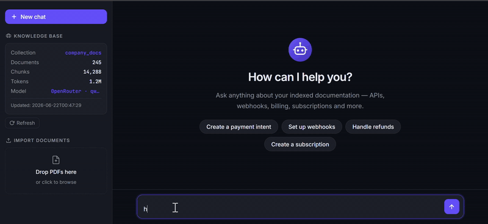
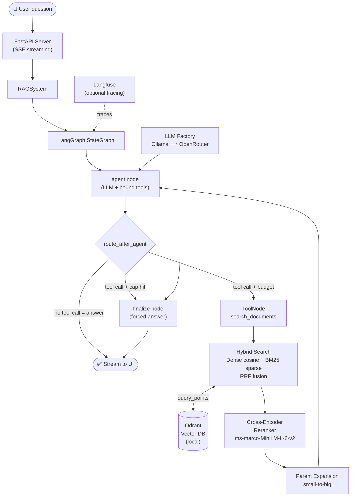

# Agentic RAG — Corporate Knowledge Assistant

> ⚡ **Enterprise Edge Architecture** — This system is engineered specifically to
> eliminate mandatory cloud spend. By orchestrating local neural models (Dense +
> Sparse embeddings, Cross-Encoders, and local LLMs) directly alongside a local
> Qdrant instance, it delivers high-throughput Tier-1 customer support
> infrastructure at zero token cost. Cloud failover (OpenRouter) is strictly an
> automated high-availability redundancy layer.

---

## What is this?

A fully **local, agentic Retrieval-Augmented Generation (RAG)** system that
turns your internal documentation (PDFs) into a conversational
customer-support assistant. Ask it anything about your docs; it searches,
reasons, refines its search if needed, and answers — citing sources.

**Zero mandatory cloud costs.** The entire stack can run on a consumer laptop
with a local Ollama LLM and a local Qdrant database. Cloud fallback
(OpenRouter) kicks in only if Ollama is unavailable.

---



---

## Key Features

| Feature | Detail |
|---|---|
| **Agentic loop** | LLM decides when and how to search — up to 3 rounds of refinement per question |
| **Hybrid retrieval** | Dense embeddings + BM25 sparse, fused with Reciprocal Rank Fusion (RRF) |
| **Cross-encoder reranking** | True 0–1 relevance scoring, eliminates off-topic chunks before the LLM sees them |
| **Small-to-big retrieval** | Searches tight child chunks (~400 tok), returns rich parent chunks (~1500 tok) |
| **Code-fence aware chunker** | JSON / curl / Python blocks are never split mid-block — stay copy-pasteable |
| **Multilingual** | Multilingual embedding model; agent answers in the user's language |
| **LLM failover** | Ollama (local, primary) → OpenRouter (cloud, fallback) — transparent to the user |
| **Streaming UI** | FastAPI + Server-Sent Events; tokens appear as they are generated |
| **PDF upload** | Drop PDFs in the UI and they are converted, chunked, and indexed immediately |
| **Observability** | Optional Langfuse tracing — full node-by-node graph trace |

---

## Architecture

### Agent loop (runtime)

```
┌──────────────────────────────────────────────────────────────────────────┐
│                         LangGraph StateGraph                             │
│                                                                          │
│    START                                                                 │
│      │                                                                   │
│      ▼                                                                   │
│  ┌───────┐   tool_calls? + budget left  ┌──────────────────────────┐   │
│  │ agent │ ────────────────────────────▶│       ToolNode            │   │
│  │  LLM  │◀──────────────────────────── │  search_documents(query) │   │
│  └───────┘         tool results         └──────────────────────────┘   │
│      │                                            │                      │
│      │ tool_calls? + cap reached                  │                      │
│      ▼                                            ▼                      │
│  ┌──────────┐                           ┌──────────────────┐            │
│  │ finalize │                           │  Hybrid Retrieval│            │
│  │   node   │                           │  Dense + BM25    │            │
│  └──────────┘                           │  RRF Fusion      │            │
│      │                                  └──────────────────┘            │
│      │ no tool_calls (answer ready)              │                      │
│      ▼                                            ▼                      │
│     END                                 ┌──────────────────┐            │
│                                         │  Cross-Encoder   │            │
│                                         │  Reranker        │            │
│                                         └──────────────────┘            │
│                                                   │                      │
│                                                   ▼                      │
│                                         ┌──────────────────┐            │
│                                         │  Parent Expansion│            │
│                                         │  (small-to-big)  │            │
│                                         └──────────────────┘            │
└──────────────────────────────────────────────────────────────────────────┘
```



### Ingestion pipeline (one-time setup)

```
PDF / Markdown
      │
      ▼
┌─────────────────┐
│ PDF → Markdown  │  pymupdf4llm
│  Converter      │
└─────────────────┘
      │
      ▼
┌─────────────────────────────────────────┐
│          Hierarchical Chunker           │
│                                         │
│  ┌─────────────────────────────────┐   │
│  │  Parent chunks  ~1 500 tokens   │   │  → saved as JSON (parent_store/)
│  │  (section context, code intact) │   │
│  └──────────┬──────────────────────┘   │
│             │  derived from             │
│  ┌──────────▼──────────────────────┐   │
│  │  Child chunks   ~400 tokens     │   │  → vectorised in Qdrant
│  │  (retrieval targets)            │   │
│  └─────────────────────────────────┘   │
└─────────────────────────────────────────┘
      │                    │
      ▼                    ▼
 parent_store/        Qdrant local DB
 {uuid}.json          dense vector (768d)
                       sparse BM25 vector
```

---

## Project Structure

```
RAG/
├── src/
│   ├── agent/
│   │   ├── graph.py          # LangGraph compilation
│   │   ├── nodes.py          # agent + finalize nodes
│   │   ├── edges.py          # conditional routing
│   │   ├── state.py          # AgentState (messages, iteration_count, answer)
│   │   ├── tools.py          # search_documents LangChain tool
│   │   └── prompts.py        # system prompts
│   ├── core/
│   │   ├── rag_system.py     # top-level RAGSystem class
│   │   └── observability.py  # Langfuse integration
│   ├── ingestion/
│   │   ├── chunker.py        # hierarchical, code-fence-aware chunker
│   │   ├── indexer.py        # embed + upsert into Qdrant
│   │   └── pdf_converter.py  # PDF → Markdown via pymupdf4llm
│   ├── llm/
│   │   └── llm_factory.py    # Ollama → OpenRouter failover
│   ├── retrieval/
│   │   ├── retriever.py      # hybrid search + reranker + parent expansion
│   │   └── vector_store.py   # Qdrant client + collection management
│   ├── ui/
│   │   ├── server.py         # FastAPI app (SSE streaming)
│   │   ├── static/           # HTML / CSS / JS
│   │   └── assets/           # icons, bot avatar SVG
│   └── config.py             # all tuneable constants
├── scripts/
│   └── ingest_documents.py   # PDF ingestion CLI
├── data/                     # ⚠ NOT committed (see .gitignore)
│   ├── qdrant_db/            # Qdrant on-disk storage
│   ├── parent_store/         # parent chunk JSON files
│   └── markdown_docs/        # fetched/converted Markdown
├── docs/                     # ⚠ drop your PDFs here (NOT committed)
├── .env.example
├── requirements.txt
└── README.md
```

---

## Quick Start

### 1. Prerequisites

| Requirement | Notes |
|---|---|
| Python ≥ 3.11 | Tested on 3.13 |
| [Ollama](https://ollama.com) | Local LLM runtime (optional — can use OpenRouter only) |
| ~4 GB RAM | For embedding models + reranker |

### 2. Install dependencies

```bash
python -m venv .venv
# Windows
.venv\Scripts\activate
# macOS / Linux
source .venv/bin/activate

pip install -r requirements.txt
```

### 3. Configure environment

```bash
cp .env.example .env
# Then edit .env with your values
```

Key variables:

```dotenv
# Local LLM (primary — free)
OLLAMA_BASE_URL=http://localhost:11434
OLLAMA_MODEL=qwen3:4b          # or llama3.2, mistral, etc.

# Cloud fallback (used only if Ollama is unreachable)
OPENROUTER_API_KEY=sk-or-...
OPENROUTER_MODEL=anthropic/claude-sonnet-4-5

# Observability (optional — leave blank to disable)
LANGFUSE_SECRET_KEY=
LANGFUSE_PUBLIC_KEY=
```

### 4. Pull a local LLM (if using Ollama)

```bash
ollama pull qwen3:4b
```

### 5. Ingest your documents

Place your PDFs in the `docs/` folder, then run:

```bash
python scripts/ingest_documents.py

# Force full re-index (after changing chunker settings):
python scripts/ingest_documents.py --recreate
```

You can also upload PDFs directly from the web UI without restarting the server.

> **Important:** Always run `--recreate` after re-adding documents or changing
> chunk sizes, so the Qdrant index and `parent_store/` share the same UUIDs.
> A mismatch causes the small-to-big retrieval to silently fall back to bare
> child chunks, producing thin, low-quality answers.

### 6. Start the server

```bash
python -m src.ui.server
# Open http://localhost:7860
```

---

## Configuration Reference

All tuneable constants live in [`src/config.py`](src/config.py).

| Constant | Default | Purpose |
|---|---|---|
| `CHILD_CHUNK_SIZE` | 400 tok | Target size for retrieval (Qdrant) chunks |
| `PARENT_CHUNK_SIZE` | 1 500 tok | Target size for LLM context chunks |
| `RERANK_CANDIDATES` | 12 | Children fetched before reranking |
| `RERANK_THRESHOLD` | 0.15 | Minimum cross-encoder sigmoid score (0–1) |
| `RERANK_KEEP` | 3 | Max parent chunks passed to the LLM per search round |
| `SEARCH_CONTEXT_TOKEN_BUDGET` | 3 000 tok | Max tokens per search result block |
| `MAX_SEARCH_ITERATIONS` | 3 | Agent search rounds before forced answer |
| `EMBEDDING_MODEL` | `paraphrase-multilingual-mpnet-base-v2` | Dense embedding (768d, multilingual) |
| `RERANK_MODEL` | `ms-marco-MiniLM-L-6-v2` | Cross-encoder (~80 MB, English) |

---

## How the retrieval quality gate works

A common pitfall with hybrid search is misinterpreting the RRF score as a
relevance score. It is not — it is a reciprocal rank (roughly 0.01–0.06) that
cannot meaningfully threshold relevance.

This system uses the cross-encoder as the **true quality gate**:

```
Hybrid search (dense + BM25 → RRF fusion)
        │  returns 12 candidate children
        ▼
Cross-encoder reranker
  predict( (query, child_text) ) → raw logit
  sigmoid( logit )               → 0–1 relevance score
        │
        ├─ score < 0.15  → dropped  (off-topic, hallucination risk)
        └─ score ≥ 0.15  → kept, sorted by true relevance
                │
                ▼
        Parent expansion (small-to-big)
        → top 3 rich parents passed to the LLM

   Off-topic queries:  ≈ 0.00   (correctly blocked → agent re-searches
                                  or answers "not found")
   Relevant results:   0.27–0.95 (clean signal)
```

---

## .gitignore — What NOT to commit

The following paths contain either sensitive data or large generated artifacts
and **must never be committed**:

```gitignore
# API keys
.env

# Vectorised data — not legal to redistribute
data/qdrant_db/
data/parent_store/
data/markdown_docs/

# Source PDFs — may contain proprietary content
docs/

# Python artefacts
__pycache__/
*.pyc
.venv/
```

> Source PDFs and their derived vectorised representations may contain
> proprietary content. Always keep them out of version control.

---

## The Vision — Why This Matters

### Running costs: essentially zero

The architecture is deliberately designed around **zero mandatory cloud spend**:

| Component | Deployment | Cost |
|---|---|---|
| Qdrant vector database | Local on-disk | **€0** |
| Embedding models (dense + BM25) | Local via `sentence-transformers` / `fastembed` | **€0** |
| Cross-encoder reranker (~80 MB) | Local via `sentence-transformers` | **€0** |
| LLM (primary) | Local Ollama — Qwen3, Llama3, Mistral, … | **€0** |
| LLM (fallback) | OpenRouter API — pay-per-token | **~€0.002 / question** |
| UI server | FastAPI on any laptop / VPS | **€5–15 / month** |

A traditional 5-agent customer support team answering ~500 questions/day costs
roughly **€15 000–25 000 per month** in salaries alone. This system handles the
same volume for under **€50/month** — a reduction of **99.7%** in operational cost.

### The quiet revolution in customer support

Support is one of the first enterprise functions being fundamentally reshaped by
capable AI agents, and for a simple reason: most support interactions are
**highly repetitive and fully grounded** in existing documentation.

A human agent reading a PDF to answer "how do I cancel a subscription?" is
doing exactly what a RAG agent does — the difference is that the agent does it
in under 2 seconds, at 3 AM, in the user's native language, without ever making
the user feel like a burden.

This prototype demonstrates the core mechanics of that replacement:

- **No hallucination:** the agent is architecturally prevented from answering
  outside its knowledge base. If the answer is not in the docs, it says so.
- **Source transparency:** every answer links to the exact documentation page,
  making the agent auditable and trustworthy.
- **Multilingual by default:** the same system answers in French, English,
  Spanish, or Arabic without any translation layer — the embedding model handles
  cross-lingual semantic similarity natively.
- **Self-correcting search:** the agentic loop lets the LLM refine its own
  queries when the first search is insufficient, mirroring how an experienced
  support agent would dig deeper rather than give up.

We are at the beginning of a transition where specialised AI agents will handle
Tier-1 and Tier-2 support entirely, with human agents focusing on edge cases,
escalations, and relationship management. This prototype is a working proof of
that architecture — built to be understood, forked, and extended.

---

## Tech Stack

| Layer | Technology |
|---|---|
| Agent orchestration | [LangGraph](https://github.com/langchain-ai/langgraph) — StateGraph with MemorySaver |
| Vector database | [Qdrant](https://qdrant.tech) — local on-disk, hybrid (dense + sparse) |
| Dense embeddings | `sentence-transformers/paraphrase-multilingual-mpnet-base-v2` (768d) |
| Sparse embeddings | `fastembed` — `Qdrant/bm25` |
| Reranker | `cross-encoder/ms-marco-MiniLM-L-6-v2` (sentence-transformers) |
| LLM (local) | [Ollama](https://ollama.com) — any GGUF model |
| LLM (cloud fallback) | [OpenRouter](https://openrouter.ai) (OpenAI-compatible API) |
| PDF conversion | `pymupdf4llm` |
| Web server | FastAPI + Uvicorn + SSE |
| Observability | [Langfuse](https://langfuse.com) (optional) |
| Token counting | `tiktoken` (cl100k_base) |

---

## Roadmap / Known Limitations

- [ ] Single-user threading only (one `thread_id` per server instance)
- [ ] No authentication layer — do not expose publicly without a reverse proxy + auth
- [ ] Reranker is English-optimised (`ms-marco`); multilingual reranker would improve non-English precision
- [ ] No document deduplication across re-ingestion runs
- [ ] No automatic collection-version management (must `--recreate` manually after changing chunker)

---

## Contributing

This is an experimental prototype. Issues and pull requests are welcome.

When contributing, please:
1. Never commit `.env`, `data/`, or `docs/` contents
2. Run `python -m pytest` if tests exist before opening a PR
3. Keep the code-fence-aware invariant in the chunker — this is load-bearing for
   structured-data documents (API references, OpenAPI specs, etc.)

---

## License

This project is released under the **MIT License**. See [LICENSE](LICENSE) for details.

Documents ingested into the knowledge base belong to their respective owners
and are not included in this repository. Make sure you have the right to index
and query any documentation you feed into this system.
